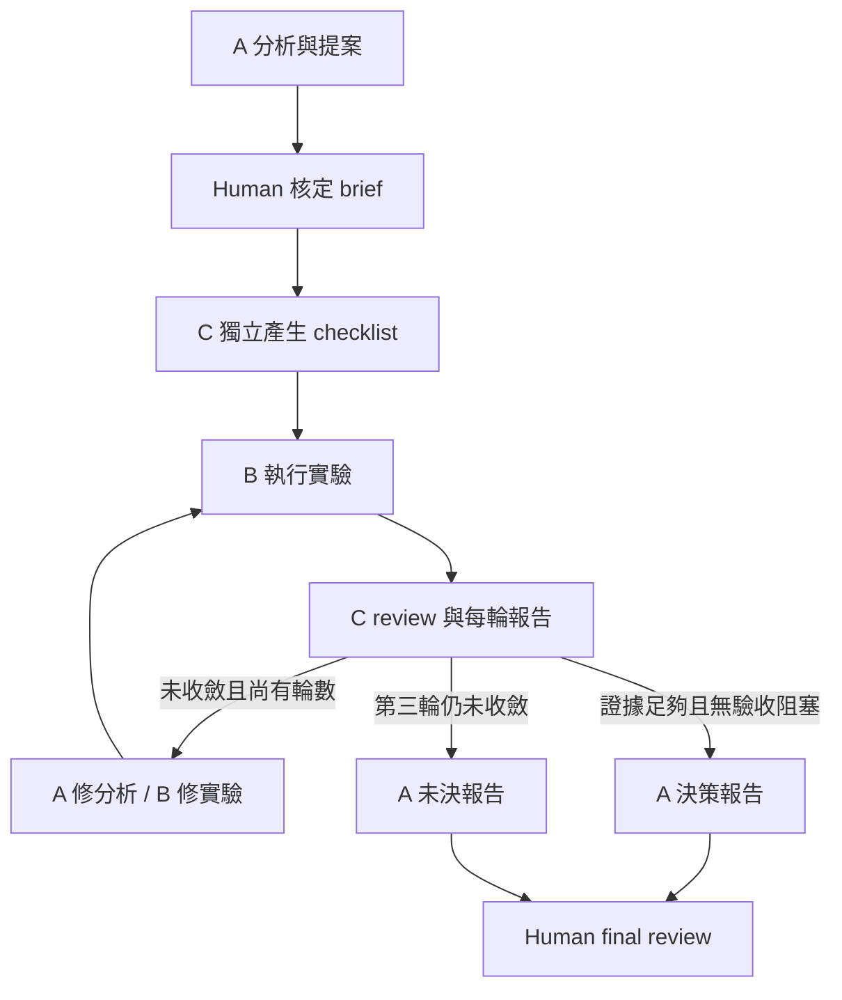

# IC Technical Survey / PoC Agent Team

在 Claude Code 輸入 `/tech-poc <技術問題>`，啟動 A/B/C 協作。
每次處理一個可決策的技術問題；適用於 Web Application 與 CCTV 邊緣 AI。

| 角色 | 預設模型 | 工作 |
|---|---|---|
| A | Opus | 架構、impact、方案分析；修正假設；整合主管報告 |
| B | Opus | 最小 PoC／實驗、可重現證據、方案 pros/cons |
| C | Sonnet | 獨立驗證案例、每輪 review、證據缺口與修正要求 |
| Human | — | decomposition、核定問題／門檻、衝突裁決、final review |

## 使用前

- macOS／Linux、Python 3.10+、已登入的 Claude Code CLI。本機開發驗證版本為 2.1.233。
- 操作包放在專案根目錄 `agent-team/`；啟動 skill 放在
  `.claude/skills/tech-poc/SKILL.md`。既有專案或全域 Claude 設定不需修改。
- Claude Code skills：[官方文件](https://code.claude.com/docs/en/skills)。
  CLI JSON、schema、session resume：[官方文件](https://code.claude.com/docs/en/headless)。
- 本套件透過獨立 `claude -p` sessions 執行角色；不需開啟原生 Agent Teams。
  每個角色保留自己的 session；C 的實際模型不得與 A/B 重疊。
  CLI 原始輸出保留 token 用量，正式績效仍只有四項。
  續接 session 的 CLI 費用統計會包含先前用量，請比較各角色最新紀錄，避免逐次加總累計值。

移到另一個專案時，複製 `agent-team/`（排除 `runs/`、`__pycache__/`）及
`.claude/skills/tech-poc/` 到該專案根目錄，即可使用相同入口。

## 流程



C 在看到 B 的結果前，先根據核定問題、門檻及架構事實完成案例。
停止條件看的是「證據能否支持判定」，不是候選技術是否通過產品門檻；
有可重現證據的淘汰結論也能收斂。

最多三次 B 執行，包含首輪。每次 B 啟動前先保留輪次，失敗／中斷也會消耗
該輪，避免重試越過上限。C review 或 A 報告失敗後可從 checkpoint 接續，
不重跑已完成的 B。第三輪未收斂交給你裁決，不會自動開始第四輪。

## 手動 CLI 操作

以下命令從專案根目錄執行；路徑若有空白請加引號。

```bash
cp agent-team/templates/brief.json agent-team/brief.json
# 編輯 brief.json：實際技術問題、scope、criterion IDs、門檻與限制。
python3 agent-team/team.py init --run agent-team/runs/my-question \
  --brief agent-team/brief.json --workspace /absolute/path/to/target-project
python3 agent-team/team.py prepare --run agent-team/runs/my-question
```

閱讀 `analysis.md` 和 `approved-brief.json`；你可編輯後者。確認後才執行：

```bash
python3 agent-team/team.py approve --run agent-team/runs/my-question
python3 agent-team/team.py run --run agent-team/runs/my-question
python3 agent-team/team.py status --run agent-team/runs/my-question
```

`init` 是正式交付題目的計時起點；`prepare` 會呼叫 A 並消耗 Claude tokens。
`approve` 是人的初始核定；模型的任何文字都不會自動批准。
模型可在 `init` 用 `--model-a opus --model-b opus --model-c sonnet` 指定其他
alias 或完整 model ID。實際模型 ID 從 CLI stream 中的主 session assistant
`message.model` 驗證；缺少 metadata 或 C 與 A/B 重疊就停止，也會檢查中途
fallback。`modelUsage` 只作用量診斷，避免把共用的輔助模型誤認為角色模型。
欄位定義見 [官方 SDK 文件](https://code.claude.com/docs/en/agent-sdk/python#assistantmessage)。

`allowed_commands` 是人核定的 Claude Bash permission patterns，例如
`Bash(python3 -m pytest *)`。初始範本為空；填入實驗與驗證實際需要的命令。
A/C 沒有 Edit/Write 工具，B 的檔案修改授權限於指定 workspace。
CLI 使用 `dontAsk`：既有 deny 規則仍生效，需要新權限的工具呼叫會失敗。
讀取公開來源與專案檔案已允許；shell patterns 不等於 OS sandbox，需按實驗
需要核定。請選擇自己信任的 target project，其 Claude hooks/settings 仍會載入。
角色使用上述工具清單，MCP servers 在這些子 sessions 中停用。

## 人工裁決、錯誤與修正

`needs_human` 暫停後，檢查 `state.json` 的 human_request、該輪報告和證據。
需要裁決的狀態與結果一起保存；中斷後重新執行仍需先完成人工裁決。
若需要變更 brief，先由你核定，修改 `approved-brief.json`，再執行：

```bash
python3 agent-team/team.py resolve --run agent-team/runs/my-question \
  --note "Human-approved ruling, including the exact authorized change"
python3 agent-team/team.py run --run agent-team/runs/my-question
```

scope/criteria 改變時，C 會用新的獨立 context 重新形成 checklist；輪數不歸零。
已用完三輪的單位須另立新的問題，不能透過 resolve 增加輪數。
同範圍內的裁決會讓 C 重新評估既有 B 證據，再決定是否需要下一輪。
若你在 final review 退回尚未核可的報告，也可用 `resolve --note ...` 交回
C 評估；已使用輪數不歸零。修改後須再次經你的 final review 才能 finish。

呼叫錯誤保存在 `last_error` 與 `calls/` 原始輸出。修正環境後再 `run`，
狀態機會從保存的階段接續。模型、登入或權限有問題時，先修正設定／核定
必要資源，不能把失敗的 CLI 回應當成實驗證據。
同一 run 一次只能有一個修改命令，避免並行重跑和計數競爭；`status` 可隨時讀取。

## Final review 與四個數字

閱讀 `decision-report.md`；未收斂時閱讀 `escalation-report.md`。
範本見 `templates/review-report.md`、`templates/decision-report.md`。
主管報告保留未知、未解異議、證據限制與後續選項。你負責技術結論，高層決策。

Human Review Time 記錄所有人的主動投入，不包含等待 LLM／實驗：

```bash
python3 agent-team/team.py human-start --run agent-team/runs/my-question
python3 agent-team/team.py human-stop --run agent-team/runs/my-question
# 或補登外部計時的投入秒數：
python3 agent-team/team.py human-add --run agent-team/runs/my-question --seconds 120
```

在模型執行期間先暫停人工計時；執行器忙碌時其他修改命令會被拒絕。
若未記錄人力時間，finish 必須提供核對過的總秒數，避免把未記錄當成零。
核可報告並核對重工後：

```bash
python3 agent-team/team.py finish --run agent-team/runs/my-question \
  --human-seconds 900 --major-rework 1
```

`--human-seconds`、`--major-rework` 是人工核對的總數，會取代自動／先前累計值。
已有正確計時／重工紀錄時可省略。未決報告若由你明確接受，需加
`--inconclusive`；outcome 仍為 inconclusive，不會改稱收斂。
`finish` 會重新檢查核定 brief；報告產生後若修改問題、scope 或門檻，須先
經 `resolve` 與重新評估，不能直接核可舊證據。

| metrics.json 欄位 | 單位與定義 |
|---|---|
| Lead Time | 秒；正式交付到核可報告，含等待與重工 |
| Human Review Time | 秒；decomposition、門檻、協調、裁決、review、報告修改等全部主動投入 |
| Major Rework | 次；實際執行的重大糾正循環。C 標記、你核對；正常探索與正確否證不計 |
| Defects | 個；final review 首次發現及核可後七天內的唯一缺陷；C 找到且已修正的問題不計 |

同一根因使用同一 defect ID，重複登錄只計一次：

```bash
python3 agent-team/team.py defect --run agent-team/runs/my-question \
  --id unsupported-latency-claim --note "First discovered during human final review"
```

報告核可前 Lead Time 為 null，其餘為累計中的暫定值。核可後七天內可登錄
缺陷與補登人力；期滿後執行 `finalize --run ...` 定稿並凍結四指標。
工具不會主動排程／通知，也不會把未觀察到的缺陷當作已驗證不存在。
token usage、model IDs、rounds 和狀態只是執行診斷，不增加第五個績效指標。
比較改善時，選擇範圍相近的問題；沒有基準時先建立基準。

## 離線驗證

```bash
python3 -m unittest discover -s agent-team/tests -v
```

測試會用 fake Claude executable 驗證完整命令交接，沒有 LLM 網路請求。
實際 Claude 登入、模型供應商回應及專案工具權限仍需以第一個真實研究題目驗證。
